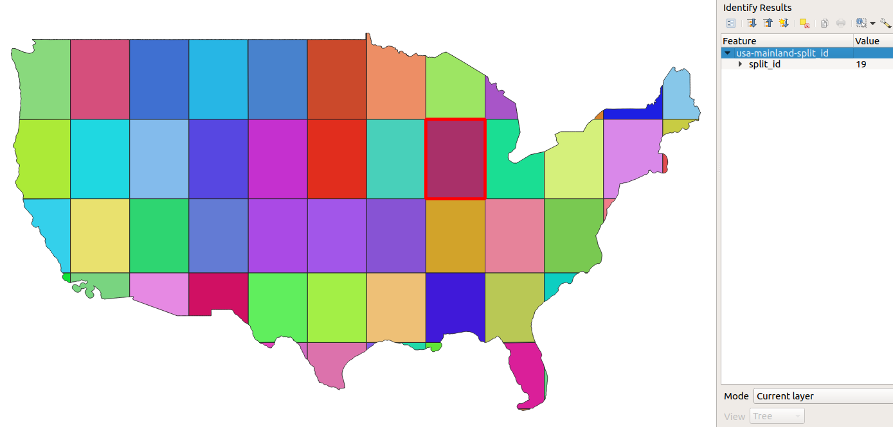

# Add autoincremental field

Add an autoincremental field to the features of a vector layer

## Requirements & Installation

See [README.md](../README.md)

## Usage

### Arguments

|Argument|Summary|Description|Optional|Default|Type|
|-|-|-|-|-|-|
|`-h/--help`|display help|display detailed usage and examples|✔|||
|`--inputlayer`|path to input layer|path to the input layer to be split (format `gpkg`, `geojson`, `kml`, `shp`)|||string|
|`--fieldname`|field name|name of the field to be added|||string|
|`--start`|start number|number to start enumerating from|✔|1|integer|
|`--outfile`|output file (absolute)|path to output file (format `gpkg`, `geojson`, `kml`, `shp`)|||string|

### Examples

See [tests.tar.gz](../tests/tests.tar.gz) for sample files to run tests on

`Add an autoincremental field named <split_id> to USA mainland split along grid lines`
```
python3 split_with_lines.py \
    --inputlayer $PWD/../tests/usa-mainland-split.geojson \
    --fieldname split_id \
    --start 1 \
    --outfile $PWD/../tests/usa-mainland-split.geojson
```

`Same example using default values`
```
python3 split_with_lines.py \
    --inputlayer $PWD/../tests/usa-mainland-split.geojson \
    --fieldname split_id \
    --outfile $PWD/../tests/usa-mainland-split_id.geojson
```



### Output

Write the generated field-added layer to the provided output file.

## Documentation

https://docs.qgis.org/3.10/en/docs/user_manual/processing_algs/qgis/vectortable.html#add-autoincremental-field

