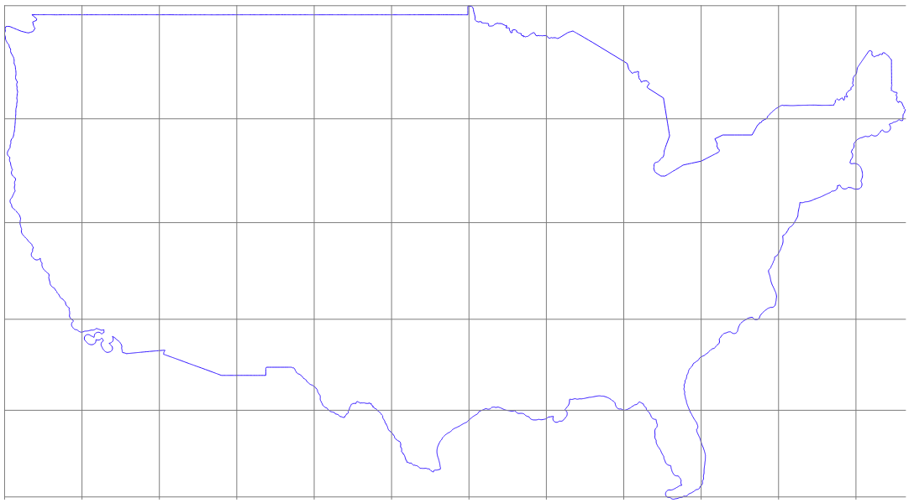

# Create grid from extent

Create a grid within the limits of a given extent

## Requirements & Installation

See [README.md](../README.md)

## Usage

### Arguments

|Argument|Summary|Description|Optional|Default|Type|
|-|-|-|-|-|-|
|`-h/--help`|display help|display detailed usage and examples|✔||
|`--gridcrs`|grid CRS|CRS for the grid|✔|EPSG:4326|string|
|`--gridtype`|grid type|type of grid:|✔|1|integer|
|||0 - point||||
|||1 - line||||
|||2 - rectangle||||
|||3 - diamond||||
|||4 - hexagon||||
|`--horizontalspacing`|horizontal spacing|horizontal spacing between grid lines|✔|1|integer / float|
|`--verticalspacing`|vertical spacing|vertical spacing between grid lines|✔|1|integer / float|
|`--gridextentpath`|path to grid extent|path to the file containing the extent for which to create the grid upon (format `gpkg`, `geojson`, `kml`, `shp`)|||string|
|`--outfile`|output file (absolute)|path to output file (format `gpkg`, `geojson`, `kml`, `shp`)|||string|

### Examples

See [tests.tar.gz](../tests/tests.tar.gz) for sample files to run tests on

`Create grid of 1x1 degree squares to include mainland USA`
```
python3 create_grid.py \
    --gridcrs 'EPSG:4326' \
    --gridtype 1 \
    --horizontalspacing 1 \
    --verticalspacing 1 \
    --gridextentpath $PWD/../tests/usa-mainland.geojson \
    --outfile $PWD/../tests/usa-mainland-grid.geojson
```

`Same example using default values`
```
python3 create_grid.py \
    --gridextentpath $PWD/../tests/usa-mainland.geojson \
    --outfile $PWD/../tests/usa-mainland-grid.geojson
```



### Output

Write the generated grid layer to the provided output file.

## Documentation

https://docs.qgis.org/3.10/en/docs/user_manual/processing_algs/qgis/vectorcreation.html#create-grid

