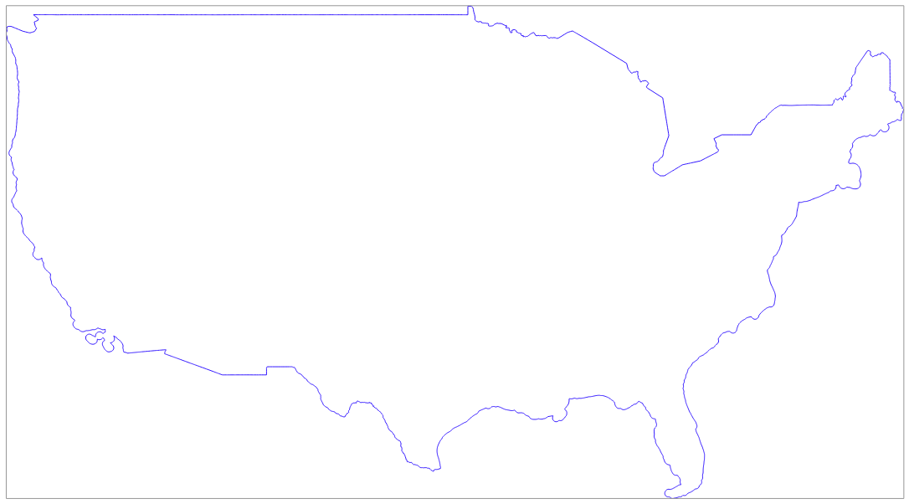

# Polygon from layer extent

Create a polygon from a layer extent

## Requirements & Installation

See [README.md](../README.md)

## Usage

### Arguments

|Argument|Summary|Description|Optional|Default|Type|
|-|-|-|-|-|-|
|`-h/--help`|display help|display detailed usage and examples|✔|||
|`--inputlayer`|path to input layer|path to the input layer to be split (format `gpkg`, `geojson`, `kml`, `shp`)|||string|
|`--outfile`|output file (absolute)|path to output file (format `gpkg`, `geojson`, `kml`, `shp`)|||string|

### Examples

See [tests.tar.gz](../tests/tests.tar.gz) for sample files to run tests on

`Add an autoincremental field named <split_id> to USA mainland split along grid lines`
```
python3 polygon_from_layer_extent.py \
    --inputlayer $PWD/../tests/usa-mainland.geojson \
    --outfile $PWD/../tests/usa-mainland-extent.geojson
```



### Output

Write the generated polygon to the provided output file.

## Documentation

https://docs.qgis.org/3.10/en/docs/user_manual/processing_algs/qgis/layertools.html#extract-layer-extent

