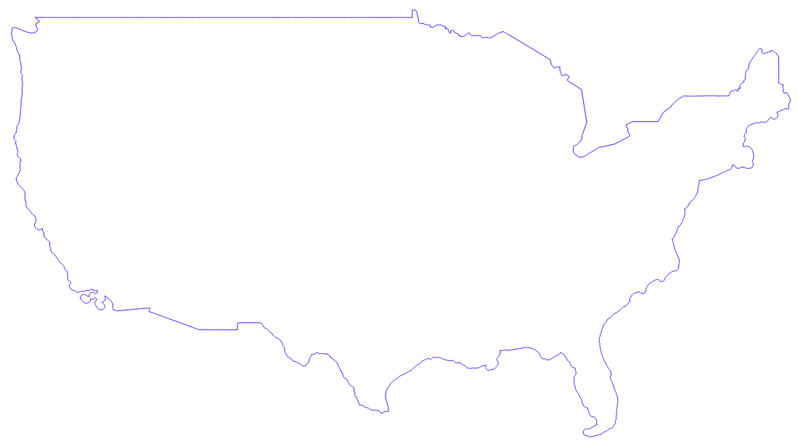
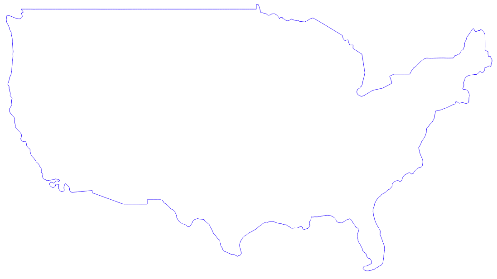

# Simplify geometries

Simplify geometries of a polygon using a method and a tolerance

## Requirements & Installation

See [README.md](../README.md)

## Usage

### Arguments

|Argument|Summary|Description|Optional|Default|Type|
|-|-|-|-|-|-|
|`-h/--help`|display help|display detailed usage and examples|✔|||
|`--inputlayer`|path to input layer|path to the input layer to be split (format `gpkg`, `geojson`, `kml`, `shp`)|||string|
|`--method`|method|simplification method:|||integer|
|||0 - distance (Douglas-Peucker)||||
|||1 - snap to grid||||
|||2 - area (Visvalingam)||||
|`--tolerance`|tolerance|tolerance of simplification (0 = no simplification)|||integer/float|
|`--outfile`|output file (absolute)|path to output file (format `gpkg`, `geojson`, `kml`, `shp`)|||string|

### Examples

See [tests.tar.gz](../tests/tests.tar.gz) for sample files to run tests on

`Simplify USA mainland using snap-to-grid method with a tolerance of 0.25`
```
python3 simplify_geometries.py \
    --inputlayer $PWD/../tests/usa-mainland.geojson \
    --method 1  \
    --tolerance 0.25 \
    --outfile $PWD/../tests/usa-mainland-simplified.geojson
```

*Original: 73,916 vertices*      
      

*Simplified: 1,115 vertices*      
      

### Output

Write the generated simplified polygon to the provided output file.

## Documentation

https://docs.qgis.org/3.10/en/docs/user_manual/processing_algs/qgis/vectorgeometry.html#simplify

