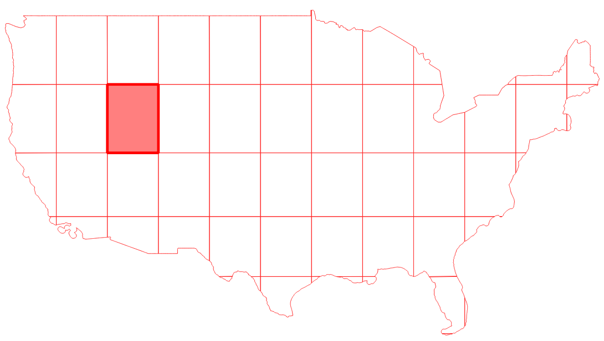

# Split with lines

Split a layer with another layer's lines

## Requirements & Installation

See [README.md](../README.md)

## Usage

### Arguments

|Argument|Summary|Description|Optional|Default|Type|
|-|-|-|-|-|-|
|`-h/--help`|display help|display detailed usage and examples|✔|||
|`--inputlayer`|path to input layer|path to the input layer to be split (format `gpkg`, `geojson`, `kml`, `shp`)|||string|
|`--splitlayer`|path to split layer|path to the split/grid layer (format `gpkg`, `geojson`, `kml`, `shp`)|||string|
|`--outfile`|output file (absolute)|path to output file (format `gpkg`, `geojson`, `kml`, `shp`)|||string|

### Examples

See [tests.tar.gz](../tests/tests.tar.gz) for sample files to run tests on

`Split mainland USA along its grid lines`
```
python3 split_with_lines.py \
    --inputlayer $PWD/../tests/usa-mainland.geojson \
    --splitlayer $PWD/../tests/usa-mainland-grid.geojson \
    --outfile $PWD/../tests/usa-mainland-split.geojson
```



### Output

Write the generated split layer to the provided output file.

## Documentation

https://docs.qgis.org/3.10/en/docs/user_manual/processing_algs/qgis/vectoroverlay.html#split-with-lines

